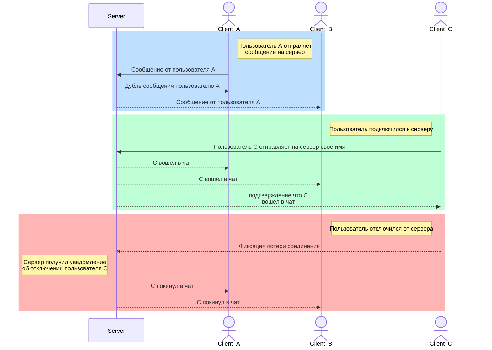
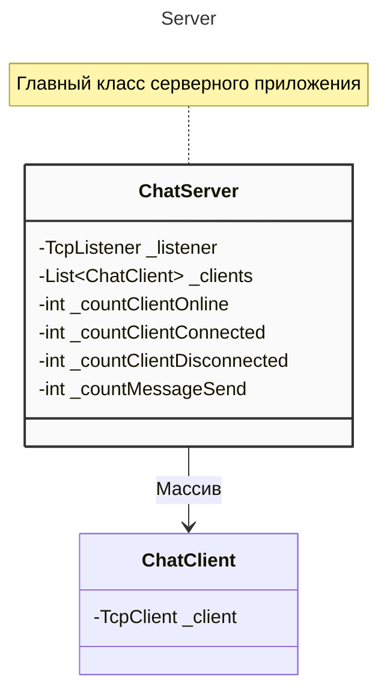

# Desktop TcpChat :speech_balloon:
## Клиентское :computer: и серверное :desktop_computer:	графические приложения для Windows 
> [!IMPORTANT]
> **Задача**:
> Реализовать графический интерфейс серверного приложения, который будет являться точкой приёмки и рассылки сообщений от клиентов. Также 
> реализовать графический интерфейс клиентского приложения, в котором можно подключаться к серверу, писать сообщения и получать сообщения от
> иных пользователей.

> [!WARNING] 
> **Необходимо применить**:
> - [x] Язык программирования C# и платформу разработки .NET
> - [x] Базовые инструменты для работы с сетями и протоколами
> - [x] Базовые инструменты для работы в асинхронном режиме

>[!NOTE]
> Технологию построения клиентских приложений (на выбор)

>[!TIP]
> **Примененные инструменты сервера:**
> * Язык программирования C# и платформу разработки .NET 8.0;
> * Для организации межсетевого взаимодействия использовались:
>   +  Протокол транспортного уровня **TCP**
>   +  Класс обертка над классом Socket: **TcpListener** (регистрация входящих подключений);
>   +  Класс обертка над классом Socket: **TcpClient** (прослушивание входящих сообщений от всех клиентов, отправка сообщений всем подключенным клиентам, подача команды на отключение хоста от сервера);
> * Для организации асинхронного режима использовались: 
>   +  Класс **Task**, (запуск в одном из потоков из пула потоков задачи по прослушиванию входящих сообщений, входящих подключений);
> * Технология построения клиентских приложений:
>   +  **WPF**(Windows Presentation Foundation) - является часть экосистемы платформы .NET и представляет собой подсистему для построения графических интерфейсов;
>   +  **MVVM** - паттерн разработки, позволяющий разделить приложение на три функциональные части:
>       + **Model** — основная логика программы (работа с данными, вычисления, запросы и так далее).
>       + **View** — вид или представление (пользовательский интерфейс).
>       + **ViewModel** — модель представления, которая служит прослойкой между View и Model.

>[!TIP]
> **Примененные инструменты клиента:**
> * Язык программирования C# и платформу разработки .NET 8.0;
> * Для организации межсетевого взаимодействия использовались:
>   +  Протокол транспортного уровня **TCP**
>   +  Класс обертка над классом Socket: **TcpClient** (прослушивание входящих сообщений от удаленного хоста, отправка сообщений серверу);
> * Для организации асинхронного режима использовались: 
>   +  Класс **Task**, (запуск в одном из потоков из пула потоков задачи по прослушиванию входящих сообщений);
> * Технология построения клиентских приложений:
>   +  **WPF**(Windows Presentation Foundation) - является часть экосистемы платформы .NET и представляет собой подсистему для построения графических интерфейсов;
>   +  **MVVM** - паттерн разработки, позволяющий разделить приложение на три функциональные части:
>       + **Model** — основная логика программы (работа с данными, вычисления, запросы и так далее).
>       + **View** — вид или представление (пользовательский интерфейс).
>       + **ViewModel** — модель представления, которая служит прослойкой между View и Model.

## Схема взаимодействия представлений

## UML диаграмма серверного приложения

